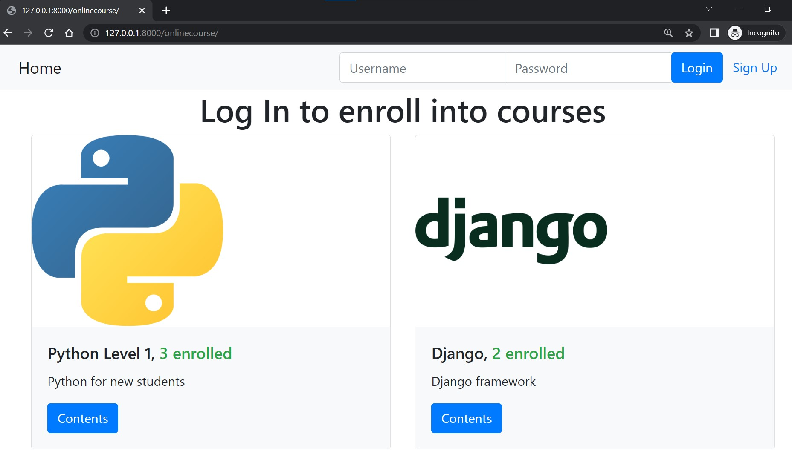
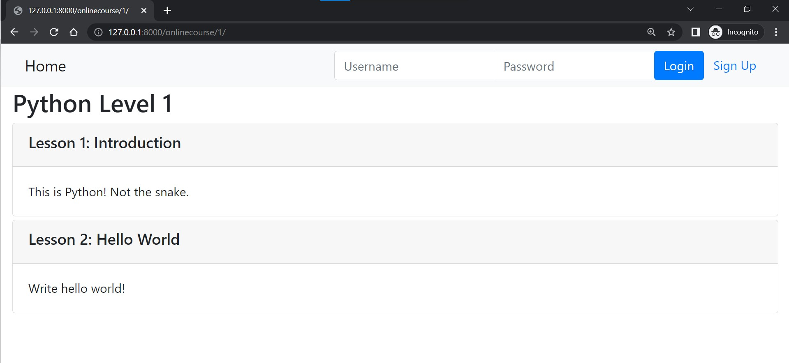
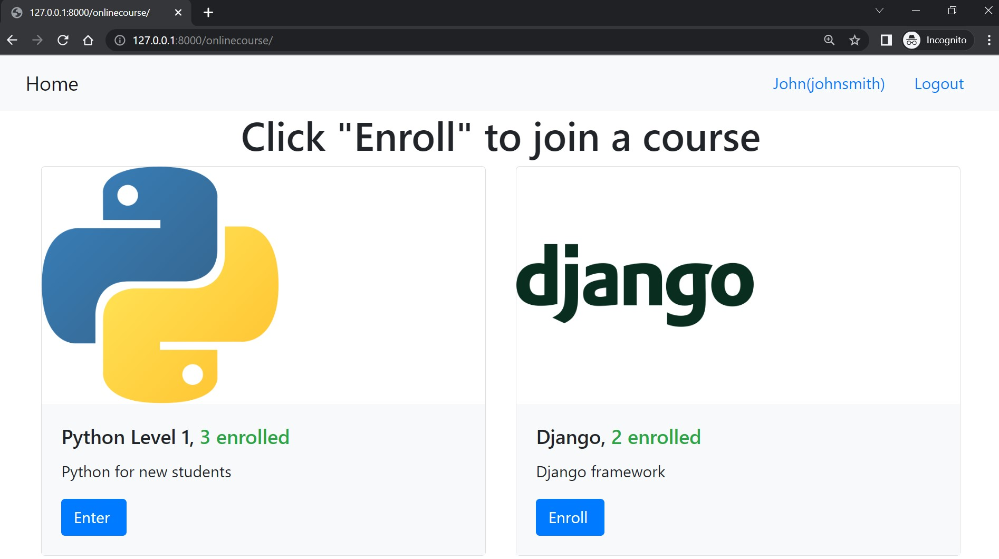
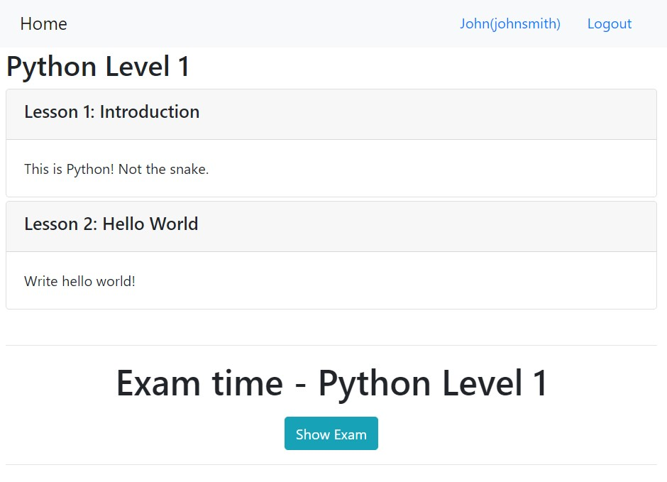
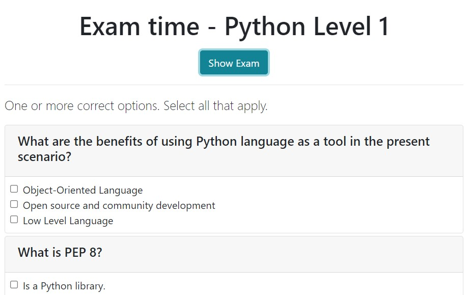
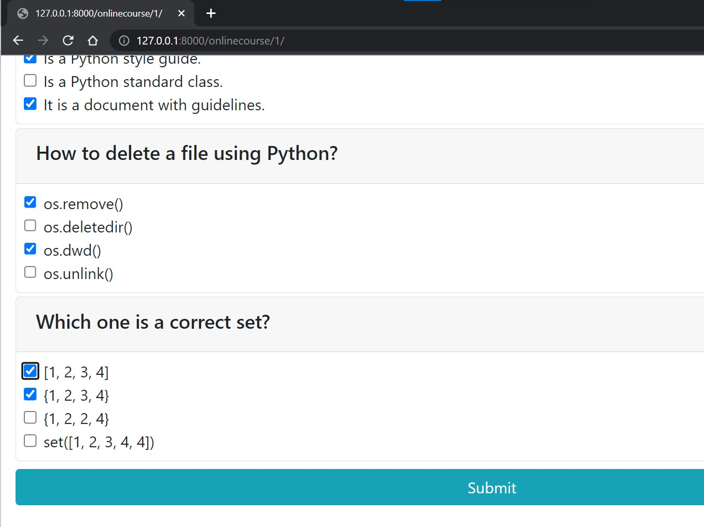
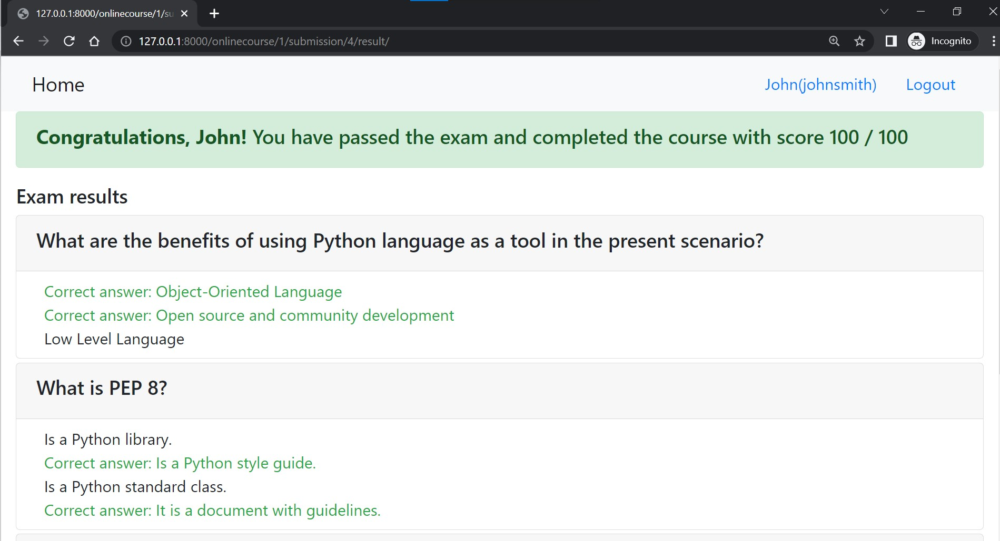
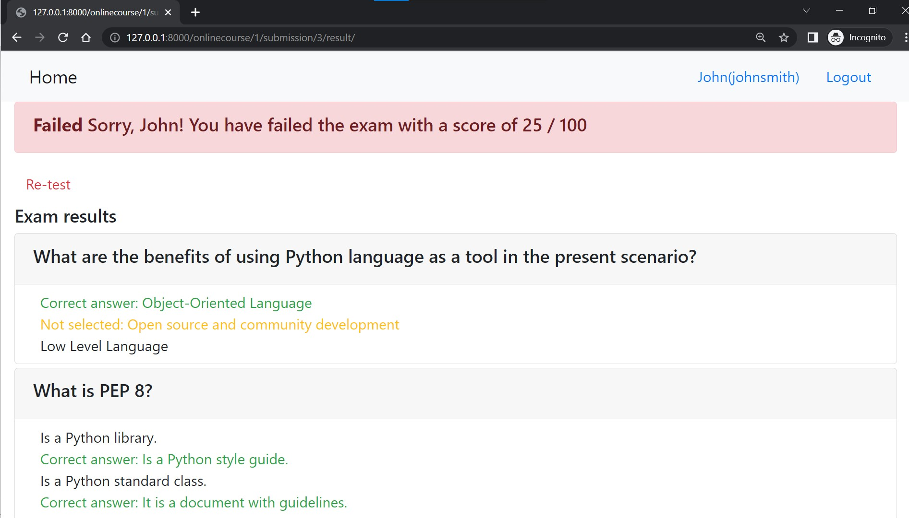
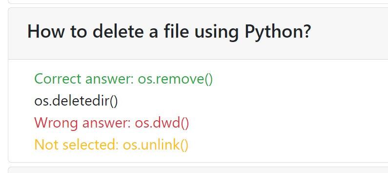

# Developing Applications with SQL, Databases, and Django
## Index
1) IBM Skills Network - Intro to the project
   1) Changes from original forked version
2) Instructions
   1) How to install
   2) Version Updates
3) Screenshots of working solution
4) Models Diagram
5) Author and Licence

## IBM Skills Network - Intro to the project
The starting point of this project can be found here [IBM Project](https://github.com/ibm-developer-skills-network/final-cloud-app-with-database). This is a fork.  
The main point of this project is to replicate what I would do in a client/new project enhancing an app in Django.  
The scope of this repository is to include an exam capability for the online courses. I included:
+ Questions with multiple choices (one or more correct).  
+ The user can see and take the exam only if it is enrolled in the course.
+ The user can submit as many exams as desired.
+ The user will be able to check the correct answers and will receive a proper message once the exam is submitted (pass, failed).
+ Security to prevent a user to see other user's submission (using a URL).

### Changes from original forked version (not updates)
- I installed in my venv newer versions of the packages than the ones required.
- Re-using html codes:
  - I changed all templates/html to use  and  / . I think this is a better way to "handle" all html files.
- If a user is not authenticated, it will be possible to check the Course contents instead of seeing "Enroll" as option.
- Minor bug fixed (suggested text is now relevant).
- Simple script insert prevention when creating a username.
- Security policy included.

## Instructions
### How to install:  
- Fork the project.
- Configure GitBash:
  - `git config --global user.email "myemail@something.com"`
  - `git config --global user.name "MyUser"`
- Local clone `git clone <URL_PROJECT>` of the project in your local machine.
- Open your favourite IDE (I use [PyCharm](https://www.jetbrains.com/pycharm/)).
- Create a virtual environment (I am using Python 3.11).
- Install required packages using `py -m pip install -U -r requirements.txt`
- Remember to Commit and Push changes to your GitHub!

### Version Updates:  
+ v0 -- 2023/03 - Deployed solution with basic HTML/Bootstrap.

## Screenshots of working solution
_Checks done in local server_  
All images are stored in readme_images folder. Delete at your own risk.  

Landing page:  

Someone can check the contents of the course even when not logged:

User logged (the user is enrolled only in one course):

Contents of the course once logged (note the Exam option):

Showing the exam:

Submitting the exam:

Exam result (passed):

Exam result (failed) -- Re-test option available:

Exam detail showing the answers provided:
- Correct answer: The user selected the correct answer.
- Wrong answer: The user selected the wrong answer.
- Not selected: Correct answer not selected.

  
### Models Diagram
Directly from forked project.

## Author and Licence
This is a forked repository from IBM in March 2023:  
**[IBM Project](https://github.com/ibm-developer-skills-network/final-cloud-app-with-database)**  
2023 Copyright © - Licence [Apache](https://github.com/ibm-developer-skills-network/final-cloud-app-with-database/blob/master/LICENSE)  

Enhancements and other modifications by:  
**[Juan Carcedo](https://github.com/JuanCarcedo)**  
